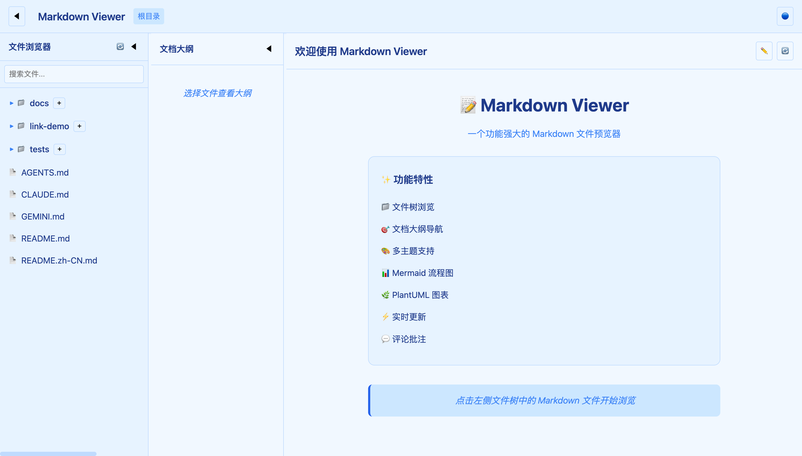
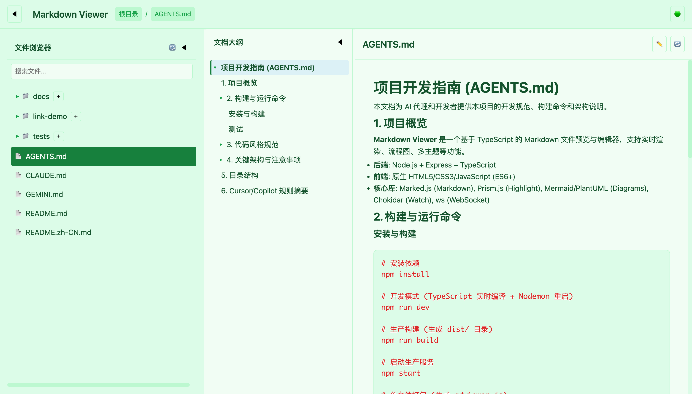
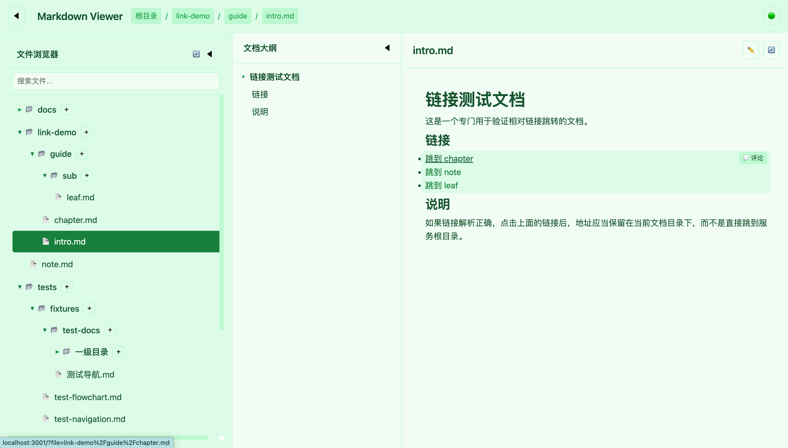
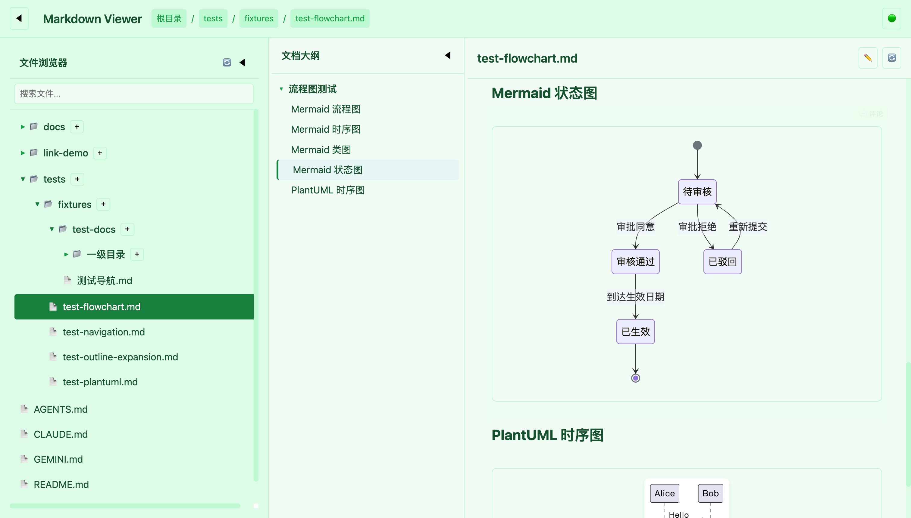
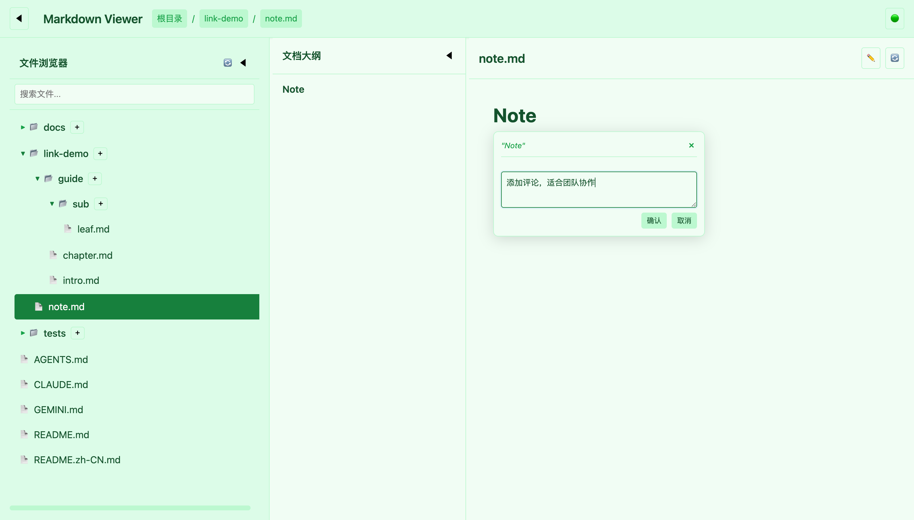
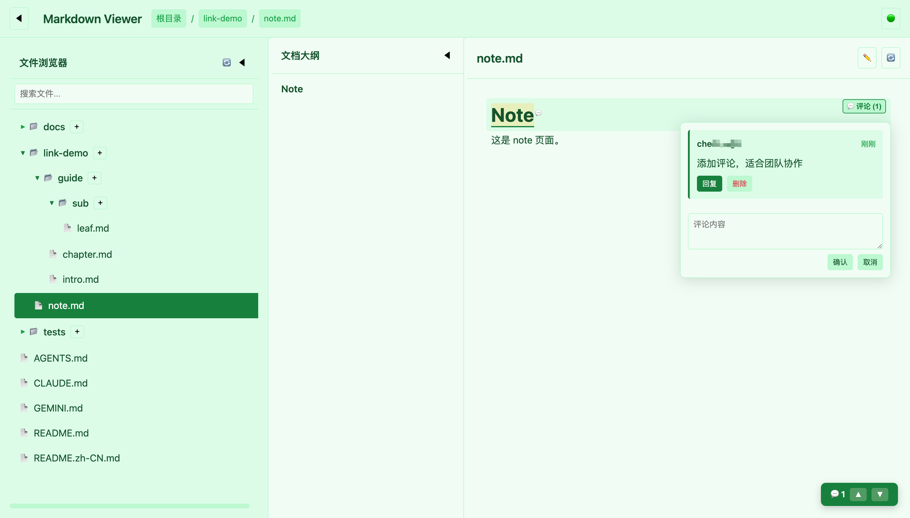
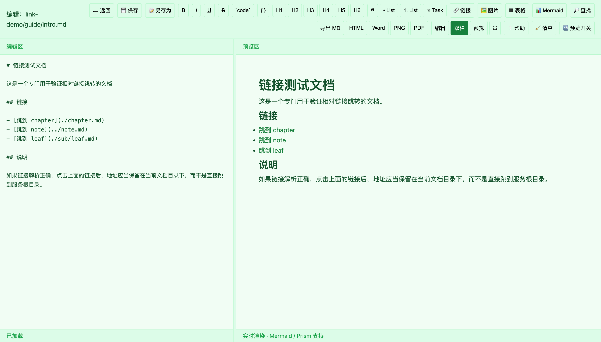

# Markdown Viewer

[中文文档](README.zh-CN.md) | English

Markdown Viewer is a TypeScript-based Markdown previewer and editor for local workspaces. It provides live rendering, a file tree, document outline navigation, Mermaid and PlantUML support, comments, multiple themes, and an enhanced built-in editor.

The backend is built with Node.js, Express, TypeScript, Chokidar, and WebSocket. The frontend uses plain HTML/CSS/JavaScript with Marked.js, Prism.js, Mermaid, KaTeX, and related browser-side utilities.

## Screenshots

| Home | Document preview with outline |
| --- | --- |
|  |  |

| Internal links | Mermaid and PlantUML diagrams |
| --- | --- |
|  |  |

| Add selected-text comments | Team comment thread |
| --- | --- |
|  |  |

| Edit and preview in real time |
| --- |
|  |

## Features

### Markdown Reading

- **GFM rendering**: headings, tables, lists, task lists, code blocks, and common Markdown syntax.
- **Document outline**: generated from headings and available on desktop and mobile layouts.
- **Code highlighting**: Prism.js-based syntax highlighting for many programming languages.
- **Diagram support**: Mermaid rendering and PlantUML fenced-code syntax support.
- **Math support**: KaTeX-powered inline and block math rendering.
- **Themes**: built-in light/dark themes with local preference persistence.

### Workspace Navigation

- **Markdown-only file tree**: browses supported Markdown files inside the selected workspace.
- **File search**: filters file names in real time and expands matched parent folders.
- **Keyboard navigation**: arrow keys, Enter, and Space for file tree navigation.
- **Context menu**: open, edit, copy path, create files/folders, and refresh actions.
- **Live updates**: Chokidar watches file changes and notifies browsers through WebSocket.

### Built-in Editor

- **Rich toolbar**: headings, bold, italic, underline, strikethrough, code, quotes, lists, links, images, tables, and Mermaid templates.
- **Live preview**: Markdown, Mermaid, and math preview inside the editor.
- **Undo/redo history**: editor-level history management.
- **Find and replace**: local text search and replacement tools.
- **Save as**: choose a target folder from the file tree and create subfolders when needed.
- **Conflict protection**: saves include `lastModified`; stale saves return `409 Conflict` unless explicitly overridden.
- **Image assets**: pasted or uploaded local images are stored under `assets/<document-name>/` and inserted with relative paths.
- **Export**: Markdown, HTML, Word, and browser print-to-PDF workflows.

### Comments and Annotations

- **Block comments**: add comments to headings, paragraphs, tables, lists, quotes, and other block elements.
- **Text selection comments**: select text and attach comments to the selected range.
- **Highlights**: commented text is highlighted with badges showing comment counts.
- **Threads**: replies are grouped into comment threads.
- **Comment navigation**: floating controls show total comments and jump between comment locations.
- **Persistence**: comments are stored in `.mdviewer-data/comments.json` in the workspace.

### Security and Packaging

- **Same-origin checks**: write APIs validate `Origin` or `Referer` to reduce CSRF risk.
- **Workspace isolation**: file operations are constrained to the selected workspace.
- **Path traversal protection**: server-side path resolution prevents escaping the workspace.
- **Single-file bundle**: production assets can be embedded into `mdviewer.js` for portable usage.

## Quick Start

### Option 1: Start Script

Linux/macOS:

```bash
chmod +x start-mdviewer.sh
./start-mdviewer.sh
```

Windows:

```cmd
start-mdviewer.bat
```

The start scripts check the Node.js/npm environment, install dependencies when needed, detect ports, and print local/LAN access URLs.

### Option 2: Manual Development

```bash
npm install
npm run dev
```

### Option 3: Production Build

```bash
npm install
npm run build
npm start
```

### Option 4: Single-file Bundle

```bash
npm run build
npm run build:bundle
node mdviewer.js
```

Install the bundle locally as `mdviewer`:

```bash
npm run release:local
mdviewer
```

## CLI Usage

```bash
# Serve a specific workspace
mdviewer --dir /path/to/markdowns

# Use a specific HTTP port
mdviewer --port 4000

# Show version
mdviewer --version

# Combine options
mdviewer --dir ~/Documents/notes --port 8080
```

After startup, open:

- Local access: `http://localhost:3001` by default.
- LAN access: `http://<your-ip>:3001`.
- Port fallback: if the requested HTTP port is busy, the server increments the port automatically.
- WebSocket port: `HTTP port + 5080`, for example HTTP `3001` uses WS `8081`.

## Supported Files

- Markdown extensions: `.md`, `.markdown`, `.mdown`, `.mkd`, `.mkdn`.
- Default workspace: current working directory.
- Custom workspace: `--dir /path/to/workspace`.
- Request body limit: `10MB` for editing large Markdown files.

## Project Structure

```text
mdviewer/
├── src/
│   ├── server.ts              # Express server, REST APIs, static assets, WebSocket
│   ├── fileUtils.ts           # Path safety, file tree, outline extraction
│   ├── assetUtils.ts          # Image asset helpers
│   ├── portUtils.ts           # Port parsing and fallback helpers
│   ├── version.ts             # Version metadata
│   └── public/                # Frontend assets
│       ├── index.html         # Viewer page
│       ├── editor.html        # Editor page
│       ├── css/
│       └── js/
├── scripts/
│   ├── embed-assets.js        # Embeds frontend assets for bundle builds
│   ├── bump-version.js        # Version bump helper
│   └── validate-plantuml.js   # PlantUML fixture validation helper
├── docs/                      # User and development documentation
├── tests/
│   ├── test-*.js              # Standalone Node.js test scripts
│   └── fixtures/              # Markdown fixtures and sample workspaces
├── README.md                  # English README
├── README.zh-CN.md            # Chinese README
├── package.json
└── tsconfig.json
```

## API Overview

### Files

- `GET /api/files`: returns the Markdown file tree for the workspace.
- `GET /api/file/:path(*)`: reads a Markdown file and returns `{ content, outline, path, lastModified }`.
- `POST /api/file/:path(*)`: saves a Markdown file with same-origin, workspace, extension, and concurrency checks.
- `GET /api/outline/:path(*)`: returns heading outline data for a Markdown file.

### Assets

- `POST /api/asset/:path(*)`: stores pasted or uploaded image assets next to a Markdown document and returns the relative Markdown path.

### Comments

- `GET /api/comments/:path(*)`: returns comments for a Markdown file.
- `POST /api/comments/:path(*)`: adds a block or selected-text comment.
- `DELETE /api/comments/:path(*)`: deletes a comment.

### Static Pages

- `GET /` and `GET /index.html`: viewer page.
- `GET /editor.html`: editor page.
- `GET /css/**`, `GET /js/**`, `GET /icon.svg`, `GET /favicon.*`: static frontend assets.

### WebSocket

- Connect to `ws://localhost:<HTTP_PORT + 5080>`.
- `connection`: initial connection event.
- `file-change`: workspace file-change notification.

## Editor Shortcuts

- `Cmd/Ctrl+S`: save current file.
- `Cmd/Ctrl+B`: bold selected text.
- `Cmd/Ctrl+I`: italic selected text.
- `Cmd/Ctrl+U`: underline selected text.
- `Cmd/Ctrl+K`: insert link.
- `Cmd/Ctrl+F`: open find and replace.
- `Cmd/Ctrl+Z` / `Cmd/Ctrl+Y`: undo / redo.
- `Cmd/Ctrl+1` to `Cmd/Ctrl+6`: insert heading levels 1 to 6.
- `Tab`: insert four spaces.

## Development

Install dependencies:

```bash
npm install
```

Run in development mode:

```bash
npm run dev
```

Build TypeScript and embedded assets:

```bash
npm run build
```

Build a portable single-file bundle:

```bash
npm run build:bundle
```

Run local tests:

```bash
npm test
```

Validate the PlantUML fixture through the remote PlantUML service:

```bash
npm run test:plantuml
```

## Versioning

The current first stable release is `1.0.0`. Future releases follow SemVer:

- `PATCH`: bug fixes.
- `MINOR`: backward-compatible features.
- `MAJOR`: incompatible changes.

```bash
npm run version:patch      # 1.0.0 -> 1.0.1
npm run version:minor      # 1.0.0 -> 1.1.0
npm run version:major      # 1.0.0 -> 2.0.0
npm run version:set -- 1.2.3
```

See `docs/VERSIONING.md` for release rules.

## Notes for Contributors

- Keep `src/fileUtils.ts` and `src/public/js/renderer.js` outline extraction behavior in sync.
- Keep all file operations behind workspace path validation.
- Prefer focused changes and update tests or docs when behavior changes.
- Standalone test scripts live under `tests/`; fixtures live under `tests/fixtures/`.

## Acknowledgements

The built-in Markdown editor in this project incorporates and adapts editing capabilities inspired by [lengyi-markdown-editor](https://github.com/woyin2024/lengyi-markdown-editor), including toolbar-based writing actions, live preview workflows, editor productivity tools, and export-related interactions.

## License

This project is licensed under the MIT License.
