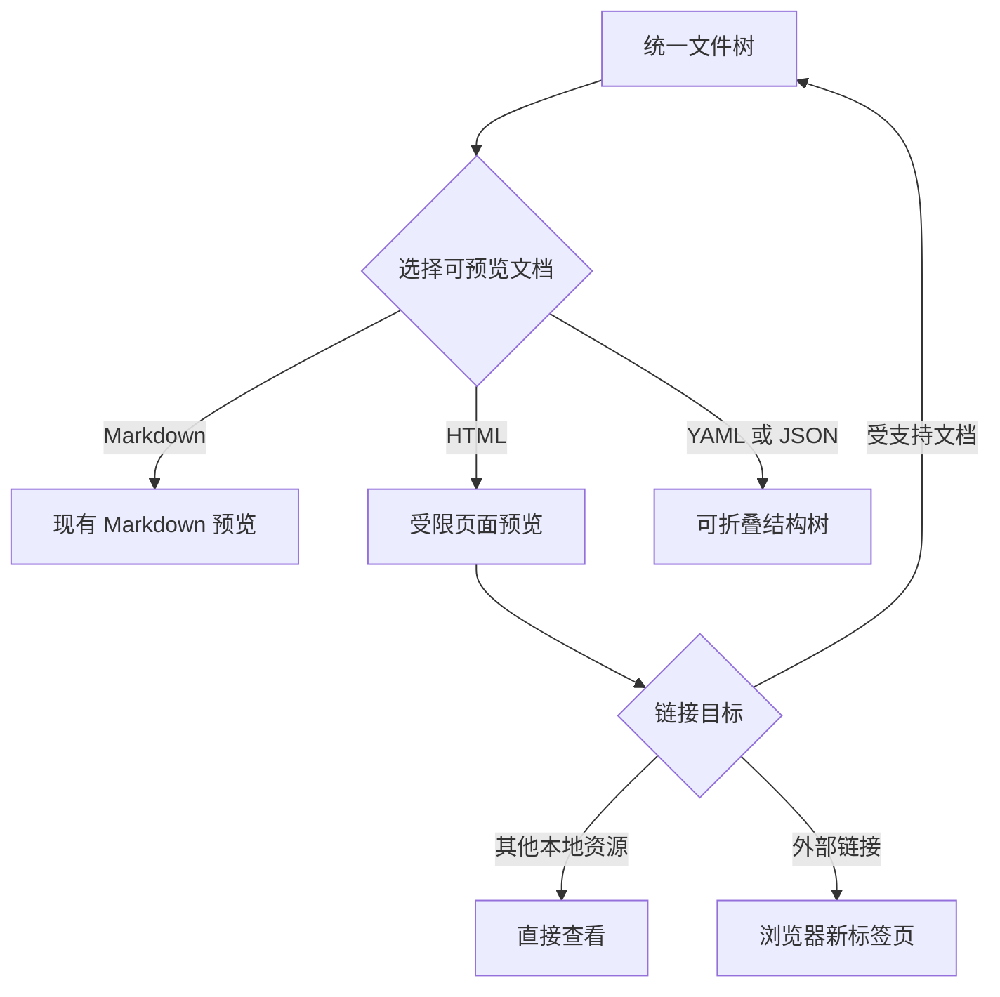
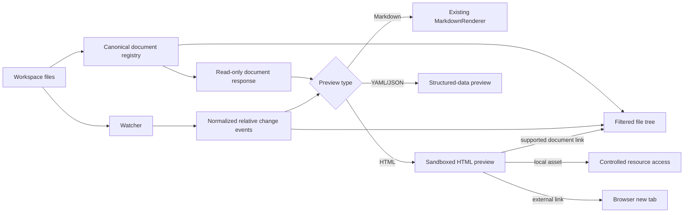

# Multi-Format Preview - Plan

<!-- AIGC START -->

## Goal Capsule

- **Objective:** 在 Markdown Viewer 的统一文件树与内容区中增加 HTML、YAML、JSON 文件的只读预览，让用户连续浏览工作区文档时不必切换浏览器或其他编辑器。
- **Product authority:** 本计划定义首版多格式预览的用户行为、支持范围、安全边界与成功标准；后续规划只能决定实现方式，不得自行扩大格式或功能范围。
- **Open blockers:** 无产品范围阻塞项。大型结构化文件的性能保障与 HTML 隔离方式由后续规划在本计划约束内确定。
- **Execution profile:** Standard cross-layer feature; execute units in dependency order and verify browser-only security, navigation, and responsiveness behaviors separately from deterministic tests.
- **Tail ownership:** The executor owns implementation cleanup and regression verification; no implementation unit is complete while abandoned experimental code or unverified security behavior remains in the diff.

---

## Product Contract

### Summary

在现有 Markdown 预览体验旁增加三类专用只读预览：HTML 以受限页面方式呈现，YAML 与 JSON 以可折叠结构树呈现。所有受支持文档共享文件树、应用内导航和文件变更自动刷新能力，同时保持 Markdown 编辑及其专属功能边界不变。

### Problem Frame

当前项目仅将 Markdown 视为可浏览文档。用户查看同一工作区内的 YAML、JSON 时需要切换到其他编辑器，查看 HTML 时需要切换到浏览器。工具切换割裂了围绕项目文件树进行连续阅读和定位的流程，也使关联文档之间的跳转失去统一上下文。

此次工作的价值不在于把 Markdown Viewer 扩展成通用文件管理器，而在于覆盖项目中常见、可形成明确预览体验的三类文档。首版需要保持能力聚焦，避免把编辑、评论、导出或任意格式插件化一并带入。

### Key Decisions

- **HTML 默认采用沙箱预览。** (session-settled: user-directed — chosen over 源码高亮或渲染/源码双模式: 用户希望直接获得接近浏览器的查看体验。) Governs R3, R4, R5, R6.
- **YAML 与 JSON 默认展示可折叠结构树。** (session-settled: user-directed — chosen over 源码高亮或双模式: 用户优先需要快速理解数据层级。) Governs R7, R8, R9.
- **HTML 可使用工作区资源和外部静态资源。** (session-settled: user-directed — chosen over 仅允许工作区资源: 用户更重视页面还原度，同时接受外部网络请求的隐私边界。) Governs R4, R5.
- **受支持文档链接留在 Viewer 内。** (session-settled: user-directed — chosen over 全部交由浏览器或外部应用: 用户希望保持连续浏览上下文。) Governs R10, R11, R12.
- **首版只读。** (session-settled: user-directed — chosen over 扩展编辑器能力: 用户当前急需的是集中预览，而非多格式编辑。) Governs R13, R14.
- **结构化数据解析失败时保留可读源码。** (session-settled: user-directed — chosen over 仅显示错误: 用户仍需定位并查看有问题的文件。) Governs R8.
- **所有大小的 YAML 与 JSON 都尝试生成结构树。** (session-settled: user-directed — chosen over 大文件自动降级或按需解析: 用户要求结构树体验保持一致。) Governs R9, R18.
- **首版扩展名集合固定。** (session-settled: user-directed — chosen over 同时覆盖 JSONC、JSON5 和 XHTML: 用户选择先覆盖最常用格式。) Governs R1.
- **文件树只展示可预览文档。** (session-settled: user-directed — chosen over 展示所有可被 HTML 引用的资源: 用户不希望产品演变成通用文件浏览器。) Governs R2, R5, R11.
- **新格式仅继承浏览基础能力。** (session-settled: user-directed — chosen over 同步支持大纲、评论和导出: 用户选择控制首版范围。) Governs R13, R14, R15.

### Actors

- A1. **工作区浏览者：** 在同一项目目录中连续查看 Markdown、HTML、YAML 和 JSON 文档。
- A2. **Markdown Viewer：** 提供文件发现、格式识别、专用预览、链接分流和自动刷新。
- A3. **外部查看环境：** 负责打开非 Viewer 文档资源或外部链接，包括系统关联应用和浏览器新标签页。

### Requirements

**文件发现与识别**

- R1. 系统必须把 `.html`、`.htm`、`.yaml`、`.yml`、`.json` 识别为可预览文档，同时继续支持现有 Markdown 扩展名；其他相似格式不在首版支持范围内。
- R2. 文件树必须只展示 Markdown、HTML、YAML 和 JSON 可预览文档，并保持目录层级；CSS、JavaScript、图片、字体及其他资源文件不得作为普通文档节点出现。

**HTML 预览与安全边界**

- R3. 用户选择 HTML 文档时，内容区必须默认显示渲染后的页面，而不是源代码视图。
- R4. HTML 预览必须禁用脚本执行和表单提交，不得允许预览内容突破应用设定的隔离边界。
- R5. HTML 预览必须允许引用工作区内的其他资源文件，并允许加载外部 CSS、图片和字体；外部资源请求应遵循用户当前网络环境。
- R6. HTML 内容加载失败、资源缺失或被安全边界阻止时，预览必须保留清晰的失败反馈，且不得影响 Viewer 其他文档的使用。

**YAML 与 JSON 预览**

- R7. 用户选择有效的 YAML 或 JSON 文档时，内容区必须默认显示可展开和折叠的层级结构，能够区分对象、数组、键和标量值。
- R8. YAML 或 JSON 解析失败时，内容区必须显示可定位的错误原因与位置，并同时回退到带行号和对应语法高亮的原始源码。
- R9. 无论 YAML 或 JSON 文件大小如何，系统都必须尝试生成结构树；处理期间必须提供明确加载反馈，并保持应用其余交互可响应。

**链接与查看分流**

- R10. HTML 中指向 Markdown、HTML、YAML 或 JSON 文档的工作区内链接必须在 Viewer 内打开目标文档并切换到对应预览。
- R11. HTML 中指向其他工作区本地资源的链接必须交由适合该资源的直接查看方式处理，而不把该资源加入文件树。
- R12. HTML 中的外部链接必须在浏览器新标签页中打开，不得替换当前 Viewer 会话。

**功能边界与一致性**

- R13. HTML、YAML 和 JSON 首版必须为只读预览，不得进入 Markdown 编辑器，也不得提供保存、另存为或内容修改入口。
- R14. HTML、YAML 和 JSON 不得提供 Markdown 专属的大纲、评论和导出能力；选择这些文件时，界面不得展示误导性的可用状态。
- R15. 新格式必须复用现有文件选择与内容区域体验，使用户可在不同支持格式之间连续切换，并能明确辨认当前文件及其格式。

**文件变化反馈**

- R16. 当前打开的 HTML、YAML 或 JSON 文件在工作区中发生外部修改时，Viewer 必须自动刷新相应预览。
- R17. 支持格式的文档被新增、删除或重命名时，文件树必须及时反映变化；若当前文件被移除，界面必须进入明确且可恢复的空闲或提示状态。

**质量约束**

- R18. 大型 YAML 或 JSON 构建结构树时，不得让文件树、导航或离开当前文件等核心交互长时间失去响应。
- R19. 新格式预览不得改变现有 Markdown 的渲染、编辑、评论、大纲、导出和自动刷新行为。

### Preview Experience Shape

### Key Flows

- F1. **选择并预览文档。** **Trigger:** 用户在文件树选择文档。 **Actors:** A1, A2. **Steps:** Viewer 识别格式，进入对应只读预览，并清除不适用于该格式的 Markdown 专属状态。 **Outcome:** 用户不离开 Viewer 即可阅读四类受支持文档。 **Covers R1, R2, R3, R7, R13, R14, R15.**
- F2. **从 HTML 跟随链接。** **Trigger:** 用户点击 HTML 预览中的链接。 **Actors:** A1, A2, A3. **Steps:** Viewer 根据目标是否为受支持工作区文档、其他本地资源或外部地址进行分流。 **Outcome:** 文档链接保持应用内上下文，其他目标由合适的外部查看环境处理。 **Covers R10, R11, R12.**
- F3. **处理结构化数据错误。** **Trigger:** YAML 或 JSON 无法解析。 **Actors:** A1, A2. **Steps:** Viewer 展示错误位置与原因，并呈现带行号和语法高亮的源码。 **Outcome:** 用户既能知道失败原因，也能继续检查文件内容。 **Covers R8.**
- F4. **响应工作区变化。** **Trigger:** 受支持文档被外部修改、新增、删除或重命名。 **Actors:** A1, A2. **Steps:** Viewer 刷新当前预览或文件树，并在当前文件消失时显示明确状态。 **Outcome:** Viewer 中的信息与工作区保持同步。 **Covers R16, R17.**

### Acceptance Examples

- AE1. **Given** 文件树中存在 `page.html`，**When** 用户选择它，**Then** 内容区显示受限的页面渲染，页面脚本不执行且表单不能提交。 **Covers R3, R4.**
- AE2. **Given** `page.html` 引用了同目录图片、工作区样式表和外部字体，**When** 页面被预览，**Then** 允许加载这些静态资源；缺失资源只影响对应内容并产生可理解反馈。 **Covers R5, R6.**
- AE3. **Given** HTML 中存在指向 `guide.md`、`config.yaml`、`data.json` 和 `other.htm` 的相对链接，**When** 用户分别点击，**Then** Viewer 在当前应用内选择并展示目标文档的对应预览。 **Covers R10.**
- AE4. **Given** HTML 中存在指向工作区图片的链接和外部网站链接，**When** 用户点击，**Then** 图片使用直接查看方式打开，外部网站在浏览器新标签页打开，当前 Viewer 会话保持不变。 **Covers R11, R12.**
- AE5. **Given** 一个有效且具有多层对象和数组的 YAML 或 JSON 文件，**When** 用户选择它，**Then** 内容区显示结构树，并允许逐层展开和折叠。 **Covers R7.**
- AE6. **Given** 一个存在语法错误的 YAML 或 JSON 文件，**When** 解析失败，**Then** 页面指出错误位置和原因，并显示带行号、语法高亮的完整源码。 **Covers R8.**
- AE7. **Given** 一个大型 YAML 或 JSON 文件，**When** Viewer 正在生成结构树，**Then** 用户看到加载反馈，仍可操作文件树或切换文件，且系统不会自行降级为仅源码预览。 **Covers R9, R18.**
- AE8. **Given** 当前打开的是 HTML、YAML 或 JSON 文件，**When** 用户寻找编辑、评论、大纲或导出入口，**Then** 这些 Markdown 专属能力不可用且不会表现为可执行状态。 **Covers R13, R14.**
- AE9. **Given** 当前打开的 JSON 文件被外部修改，**When** Viewer 收到文件变化，**Then** 结构树自动更新；**Given** 一个 YAML 文件被新增或删除，**Then** 文件树同步变化。 **Covers R16, R17.**
- AE10. **Given** 用户在 Markdown 与三种新格式之间反复切换，**When** 每个文件完成加载，**Then** 各格式展示正确的专用预览，现有 Markdown 功能保持原有行为。 **Covers R15, R19.**

### Scope Boundaries

**首版明确不包含**

- HTML、YAML 或 JSON 的编辑、保存、格式化与内容校验工具。
- HTML、YAML 或 JSON 的大纲、评论和导出。
- HTML 源码模式，以及 YAML/JSON 的源码与结构树手动切换模式。
- JSONC、JSON5、XHTML 及未在 R1 中列出的新格式。
- 把 CSS、JavaScript、图片、字体或任意工作区文件展示为普通文件树节点。
- HTML 脚本执行、表单提交或其他主动页面能力。
- 通用预览插件平台或通用文件管理器能力。

### Success Criteria

- 用户可仅通过 Viewer 完成 Markdown、HTML、YAML 和 JSON 之间的连续浏览，并能从 HTML 链接进入相关工作区文档。
- 新格式的默认展示均符合其专用预览约定，错误与加载状态足以让用户理解当前发生了什么。
- HTML 的静态资源兼容性与安全边界同时成立：允许既定资源，禁止脚本与表单能力。
- 大型结构化文件处理期间，用户仍能离开当前文件或操作文件树。
- 现有 Markdown 用户流程与功能不发生行为回归。

### Dependencies, Assumptions, and Risks

- **Dependency:** 工作区路径安全约束仍是所有本地文档、资源和链接访问的统一边界，不能因 HTML 资源支持而放宽。
- **Dependency:** 当前 Markdown 读取、渲染和变更通知链路均以 Markdown 为中心，后续规划需覆盖新格式从发现到刷新的完整闭环。
- **Constraint:** 仓库已有 JSON、YAML 和 Markup 的语法高亮资产，但现有 XML 高亮资产内容无效；后续规划不得假设所有相邻高亮资产均可直接使用。
- **Assumption:** 用户接受 HTML 外部 CSS、图片和字体产生网络请求，并理解这些请求可能向外部服务暴露常规请求信息。
- **Risk:** 用户要求大型 YAML/JSON 始终尝试生成结构树，极端文件可能带来明显耗时或内存压力；性能保护必须保留结构树目标，同时满足 R9 与 R18。
- **Risk:** HTML 对本地资源的相对引用与链接导航若语义不一致，会造成页面显示正常但点击路径错误；验收必须覆盖嵌套目录与相对路径场景。
- **Risk:** 新格式与 Markdown 专属状态共用内容区域，切换时若残留大纲、评论或编辑入口，会产生错误操作暗示。

### Sources and Verified Context

- `src/fileUtils.ts`：当前文件识别、文件树构建和读取均限定为 Markdown。
- `src/server.ts`：当前读取、保存、大纲与文件变化广播链路具有 Markdown 专属约束。
- `src/public/js/app.js`：当前文件选择统一进入 Markdown 渲染、大纲和评论流程，文件变化事件不会刷新文件树。
- `src/public/js/renderer.js`：当前内容区域由 Markdown 渲染器主导，并承载 Markdown 大纲、评论和语法高亮行为。
- `src/public/js/editor.js`：编辑、保存与导出体验均围绕 Markdown，不属于新格式首版范围。
- `src/public/js/vendor/prism/1.29.0/components/`：存在 JSON、YAML 与 Markup 高亮资产；XML 组件文件需要在规划阶段作为已知资产缺陷处理。

---

## Planning Contract

### Product Contract Preservation

Product Contract unchanged. The implementation plan below preserves the existing R/A/F/AE IDs and adds only technical decisions, implementation units, dependencies, and verification detail.

### Plan Depth and Execution Direction

- **Depth:** Standard. The feature crosses server-side file discovery and resource access, client-side preview dispatch, HTML security boundaries, structured-data parsing, WebSocket file watching, and browser behavior.
- **Execution direction:** Add deterministic pure-function and static-contract coverage before or alongside each feature-bearing unit; reserve browser/integration verification for behavior that cannot be proven from source inspection.
- **Implementation order:** U1 → U2 → U3 and U4 in parallel after U2 → U5 → U6.

### Key Technical Decisions

- KTD1. **One canonical document-type registry.** Keep supported extensions, document type, preview capability, and file-tree eligibility in one shared server-side source of truth; expose the resulting type metadata to the client instead of duplicating extension rules. This governs R1, R2, R15, R16, and R17.
- KTD2. **Read-only document reads remain separate from Markdown writes.** Extend the read path for supported preview documents while retaining an explicit Markdown-only save boundary. This preserves R13 and R19 and avoids turning preview support into an editor permission change.
- KTD3. **Controlled workspace resource access.** Route HTML-owned local resources through a validated workspace-relative access path that reuses the existing real-path boundary; do not broaden the generic static middleware as the security mechanism. This governs R4, R5, R6, and R11.
- KTD4. **HTML navigation is classified before execution.** Keep URL classification and path normalization in a testable helper, then let the HTML preview surface perform the chosen navigation action. Preserve fragment navigation, route supported documents back into the Viewer, open external URLs in a new browser tab, and use the controlled resource path for other local assets. This governs R10, R11, and R12.
- KTD5. **HTML isolation prevents active behavior by default.** Use a sandboxed preview surface with no script or form permissions, and treat resource loading as passive content loading. The exact browser-compatible combination of sandbox flags, resource URL shape, and link handoff remains an implementation-time compatibility check, not a product decision. This governs R3, R4, R5, and R6.
- KTD6. **Structured-data parsing is isolated from Markdown rendering.** Keep YAML/JSON parsing, normalization, error mapping, and tree rendering outside `MarkdownRenderer`; use a cancellable or stale-result-safe worker boundary for large inputs and incremental main-thread rendering for the tree. This governs R7, R8, R9, and R18.
- KTD7. **Failure states are first-class preview states.** Model loading, success, parse failure with source fallback, resource failure, and missing-file states explicitly so Markdown-only outline/comment/editor behavior cannot leak into other formats. This governs R6, R8, R9, R13, R14, R16, and R17.
- KTD8. **Watcher events use normalized relative paths and exact matching.** Preserve distinct `change`, `add`, and `unlink` semantics, normalize paths at the server boundary, invalidate file-tree cache for structural changes, and avoid substring matching on the client. This governs R16, R17, and R19.

### High-Level Technical Design

The implementation keeps the existing Markdown renderer as a stable branch and adds a format-aware preview boundary around it. The server owns document eligibility, safe workspace resolution, file metadata, and normalized change events. The browser owns preview selection, capability state, HTML navigation handoff, and structured-data tree interaction.

The active-data path must preserve three boundaries: document reads are read-only; HTML resource reads cannot escape the workspace; Markdown-only features are entered only on the Markdown branch. Worker cancellation or stale-result checks must prevent a previous large YAML/JSON render from replacing a newer selection.

## Implementation Units

### U1. Canonical Document Registry and Safe Read Surface

- **Goal:** Expand document discovery and read-only access to HTML, YAML, and JSON while preserving workspace safety and Markdown-only writes.
- **Requirements:** R1, R2, R5, R6, R13, R15; supports F1 and F3; preserves AE1, AE5, AE6, and AE10.
- **Dependencies:** None.
- **Files:** `src/fileUtils.ts`, `src/types.ts`, `src/server.ts`, `tests/test-document-utils.js`, `tests/test-document-api.js`.
- **Approach:**
  1. Centralize extension-to-document-type and preview-capability decisions for Markdown, HTML, YAML, and JSON.
  2. Extend file-tree filtering and read metadata to use that registry, while omitting outline extraction for non-Markdown documents.
  3. Keep the existing POST save route and asset-upload ownership checks Markdown-only.
  4. Add a separate validated resource-resolution boundary for HTML-owned local assets; it must reject workspace escapes and unsafe symlink targets before serving content.
  5. Preserve existing cache headers and return enough metadata for the client to distinguish document type and modification time.
- **Patterns to follow:** `resolveWorkspacePath` and `buildFileTree` in `src/fileUtils.ts`; current JSON API error handling and cache behavior in `src/server.ts`; `FileNode` and `FileChangeEvent` in `src/types.ts`.
- **Test scenarios:**
  - `tests/test-document-utils.js`: accept every R1 extension case-insensitively and reject JSONC, JSON5, XHTML, CSS, JavaScript, and image paths as preview documents.
  - `tests/test-document-utils.js`: build a nested tree containing Markdown, HTML, YAML, JSON, and resource files; assert only preview documents appear and directory ordering remains unchanged.
  - `tests/test-document-utils.js`: resolve a valid HTML-relative asset and reject `../` traversal, absolute workspace escapes, and a symlink pointing outside the workspace.
  - `tests/test-document-api.js`: read each supported document type with type metadata and verify Markdown retains outline metadata while other formats do not claim an outline.
  - `tests/test-document-api.js`: assert non-Markdown POST requests remain rejected and Markdown save behavior remains available.
  - `tests/test-document-api.js`: assert missing, unsupported, and unsafe paths produce stable client-visible failures without disclosing filesystem details.
- **Verification:** The registry is the only extension decision used by tree construction, reads, and watcher eligibility; all local preview/resource reads pass the workspace real-path boundary; Markdown save and asset ownership behavior remains unchanged.

### U2. Viewer Preview Dispatch and Capability Isolation

- **Goal:** Make the application choose a specialized read-only preview by document type and prevent Markdown-only controls and state from leaking into HTML/YAML/JSON views.
- **Requirements:** R3, R7, R13, R14, R15; supports F1; preserves AE1, AE5, AE8, and AE10.
- **Dependencies:** U1.
- **Files:** `src/public/js/app.js`, `src/public/js/fileTree.js`, `src/public/index.html`, `src/public/css/main.css`, `tests/test-viewer-smoke.js`, `tests/test-preview-state.js`.
- **Approach:**
  1. Introduce one application-level preview capability state derived from the server document type.
  2. Keep `MarkdownRenderer` responsible only for Markdown and route other types to dedicated preview components.
  3. Make loading, empty, error, and missing-file states explicit and clear stale renderer output before every new selection.
  4. Hide or disable top-level edit, outline, comment, and export affordances for non-Markdown documents, including file-tree context actions.
  5. Add request identity/cancellation handling so a slower prior response cannot replace the current selection.
- **Patterns to follow:** `MarkdownViewerApp.loadFile`, existing loading/error rendering, `FileTree.selectFile`, and static script-order checks in `tests/test-editor-smoke.js`.
- **Test scenarios:**
  - `tests/test-preview-state.js`: map each server document type to the expected renderer and capability set; assert Markdown retains all existing capabilities and new formats are read-only.
  - `tests/test-preview-state.js`: start a second selection before the first preview resolves; assert the stale result is ignored and the second file remains visible.
  - `tests/test-preview-state.js`: switch Markdown → HTML → YAML → JSON → Markdown and assert prior outline/comment/editor state is cleared or restored only for Markdown.
  - `tests/test-viewer-smoke.js`: assert preview containers, specialized renderer scripts, capability controls, and non-Markdown edit suppression are wired in the page.
  - `tests/test-viewer-smoke.js`: assert the existing Markdown renderer path remains present and loads before application dispatch.
- **Verification:** Every file selection has one active preview owner; non-Markdown selections cannot invoke Markdown outline/comments/save/export paths; stale asynchronous results cannot overwrite the active document.

### U3. YAML/JSON Structured Tree Preview

- **Goal:** Provide a collapsible object/array/value tree with precise parse failures and highlighted source fallback while maintaining responsiveness for large inputs.
- **Requirements:** R7, R8, R9, R18; supports F1 and F3; preserves AE5, AE6, AE7, and AE10.
- **Dependencies:** U1, U2.
- **Files:** `src/public/js/structuredPreview.js`, `src/public/js/structuredPreviewWorker.js`, `src/public/js/structuredPreviewUtils.js`, `src/public/css/main.css`, `src/public/index.html`, `tests/test-structured-preview.js`, `tests/test-structured-preview-smoke.js`.
- **Approach:**
  1. Choose and vendor a browser-capable YAML parser compatible with the repository’s offline/local-asset packaging model; keep JSON parsing standards-based and reject comments or nonstandard extensions unless the selected parser’s strict mode provides that behavior.
  2. Normalize parsed YAML/JSON into a renderer-neutral tree model that preserves object keys, array indexes, scalar types, source location metadata where available, and safe display text for special values.
  3. Run parse and normalization work behind a Worker or equivalent stale-result boundary; report loading, success, parse error, and cancellation states to the application.
  4. Render the tree incrementally or in bounded batches, with explicit expand/collapse controls and bounded DOM work per update.
  5. On parse failure, map parser offsets/line-column data into a user-readable error and render the original source with line numbers and Prism JSON/YAML highlighting.
  6. Keep exact parser package/version, worker transfer shape, and batch thresholds as implementation-time decisions validated by browser smoke and large-fixture checks.
- **Patterns to follow:** local Prism assets and script embedding via `scripts/embed-assets.js`; existing global-script loading in `src/public/index.html`; existing tree styles in `src/public/css/main.css`; standalone pure-helper testing style in `tests/test-link-utils.js`.
- **Test scenarios:**
  - `tests/test-structured-preview.js`: normalize nested objects, arrays, empty collections, null/boolean/number/string scalars, and deeply nested valid input into a stable tree model.
  - `tests/test-structured-preview.js`: parse valid JSON and YAML with equivalent structures and assert the preview model exposes the same semantic node categories.
  - `tests/test-structured-preview.js`: reject malformed JSON and malformed YAML with non-empty reason plus line/column or equivalent source location when supplied by the parser.
  - `tests/test-structured-preview.js`: assert parser output cannot create executable HTML, unsafe markup, or unbounded recursive rendering from scalar values.
  - `tests/test-structured-preview-smoke.js`: assert the Worker/renderer scripts and JSON/YAML Prism fallback assets are locally wired and the XML placeholder is not treated as a dependency.
  - Browser integration scenario: load a large valid fixture, assert visible loading feedback, eventual tree rendering, expand/collapse interaction, and continued ability to select another file before completion. Covers AE7.
- **Verification:** Valid YAML/JSON always attempts the tree path; errors show reason and location plus complete highlighted source; large fixtures remain switchable and do not allow stale results to replace a newer preview.

### U4. HTML Sandboxed Preview, Resource Access, and Link Routing

- **Goal:** Render HTML close to browser behavior while preventing active content, allowing approved static resources, and routing links according to document/resource type.
- **Requirements:** R3, R4, R5, R6, R10, R11, R12; supports F2 and F3; preserves AE1, AE2, AE3, and AE4.
- **Dependencies:** U1, U2.
- **Files:** `src/server.ts`, `src/public/js/htmlPreview.js`, `src/public/js/previewLinkUtils.js`, `src/public/index.html`, `src/public/css/main.css`, `tests/test-preview-link-utils.js`, `tests/test-html-resource-api.js`, `tests/test-html-preview-smoke.js`.
- **Approach:**
  1. Resolve the HTML document and its relative local resources against a workspace-relative base without exposing arbitrary filesystem paths.
  2. Use a sandboxed preview surface with no script or form permissions; verify the chosen same-origin/resource arrangement does not create a parent-page escape or allow active HTML behavior.
  3. Classify links before attaching navigation behavior: fragments stay within the preview, supported workspace documents return to the Viewer, other local resources use controlled direct viewing, and external URLs open in a new tab.
  4. Keep URL classification, path normalization, extension checks, query handling, fragments, encoded characters, and unsafe schemes in a pure helper; keep DOM navigation effects in the preview component.
  5. Surface resource load failures without making external resources a hard dependency for the Viewer shell.
  6. Leave exact HTML rewriting/bridge mechanics and browser-specific sandbox compatibility to implementation-time verification; any approach that cannot satisfy R4 must be rejected before merge.
- **Patterns to follow:** `resolveDocumentHref` and its tests in `src/public/js/linkUtils.js` and `tests/test-link-utils.js`; workspace boundary checks in `src/fileUtils.ts`; embedded application assets and local-first loading in `scripts/embed-assets.js`.
- **Test scenarios:**
  - `tests/test-preview-link-utils.js`: classify relative, root-relative, nested `./` and `../`, query, fragment, encoded, external HTTP(S), and unsafe `javascript:`/`data:` targets without string-prefix ambiguity.
  - `tests/test-html-resource-api.js`: serve an in-workspace CSS/image/font resource and reject traversal, outside-workspace symlink, hidden/internal, and missing-resource paths as appropriate.
  - `tests/test-html-resource-api.js`: assert resource MIME handling does not turn a local resource read into a document-tree entry or a write capability.
  - `tests/test-html-preview-smoke.js`: assert sandbox configuration excludes script and form permissions, resource base handling is present, supported-document navigation does not fall through to an unrestricted browser URL, and external navigation requests a new tab.
  - Browser integration scenario: HTML with inline script, event-handler attribute, form, local image/CSS/font, supported-document links, local asset link, fragment, and external link; assert passive rendering, allowed static resources, correct navigation target, and preserved Viewer session. Covers AE1–AE4.
- **Verification:** HTML pages render in the constrained surface; scripts, inline handlers, and form submission do not execute; approved static resources work; all three link classes route correctly; unsafe local paths never leave the workspace boundary.

### U5. File Change Events and Tree Consistency

- **Goal:** Close the server/client watcher loop for all supported document types and keep the file tree and active preview synchronized with workspace changes.
- **Requirements:** R16, R17, R19; supports F4; preserves AE9 and AE10.
- **Dependencies:** U1, U2, U3, U4.
- **Files:** `src/server.ts`, `src/types.ts`, `src/public/js/app.js`, `src/public/js/fileTree.js`, `tests/test-file-change-events.js`, `tests/test-viewer-refresh-smoke.js`.
- **Approach:**
  1. Apply the canonical document registry to add, change, unlink, and rename-equivalent watcher events.
  2. Emit normalized workspace-relative paths and retain distinct event types instead of broadcasting all structural events as generic changes.
  3. Invalidate file-tree cache for add/unlink and refresh the tree; refresh the active preview only for an exact current-path change.
  4. When the current file disappears, clear selection or show a recoverable missing-file state without leaving stale rendered content.
  5. Avoid watcher feedback loops from Viewer-owned metadata and preserve Markdown refresh behavior.
- **Patterns to follow:** watcher/cache invalidation in `src/server.ts`; `FileTree.loadFiles` and current-file expansion in `src/public/js/fileTree.js`; existing WebSocket handling in `src/public/js/app.js`.
- **Test scenarios:**
  - `tests/test-file-change-events.js`: generate add/change/unlink events for every supported extension and assert canonical relative path plus correct event type.
  - `tests/test-file-change-events.js`: assert a change to `docs/a.json` cannot refresh `docs/a.json.bak` or another path that only shares a substring.
  - `tests/test-viewer-refresh-smoke.js`: assert add/unlink reloads the file tree, change reloads the active HTML/YAML/JSON preview, and unrelated changes do not replace the active document.
  - Browser integration scenario: delete the current document, assert stale content is removed and a recoverable state appears; recreate it and assert the tree and preview recover. Covers AE9.
  - Regression scenario: modify an existing Markdown file and assert its current preview still auto-refreshes with its existing outline/comment behavior. Covers AE10 and R19.
- **Verification:** All supported extensions use one watcher eligibility rule; structural events refresh the tree; content events refresh only an exact active path; current-file deletion is visible and recoverable.

### U6. Build Packaging, Documentation, and Regression Gate

- **Goal:** Make new browser assets, parser assets, tests, and user-facing support rules part of the normal build and verification contract.
- **Requirements:** R1, R2, R3, R7, R8, R13, R14, R19; supports all acceptance flows through the final regression gate.
- **Dependencies:** U1, U2, U3, U4, U5.
- **Files:** `package.json`, `README.md`, `README.zh-CN.md`, `docs/development.md`, `scripts/embed-assets.js`, `tests/test-viewer-smoke.js`, `tests/test-structured-preview-smoke.js`, `tests/test-html-preview-smoke.js`.
- **Approach:**
  1. Ensure new public assets and parser/worker files are included by the existing embed pipeline and loaded in deterministic order.
  2. Add focused test scripts to the repository’s build-first `npm test` chain; keep browser/network-dependent checks isolated when they cannot be deterministic offline.
  3. Document supported extensions, read-only behavior, HTML script/form restrictions, local-resource behavior, and link navigation rules in the Chinese and English user/development docs.
  4. Add an asset-validity check that detects placeholder/HTML content where a Prism or parser asset is expected.
- **Patterns to follow:** build-first scripts in `package.json`; static page smoke tests; local asset embedding and versioned vendor directories; existing README API/support sections.
- **Test scenarios:**
  - `tests/test-viewer-smoke.js`: assert all new scripts, containers, style hooks, and capability controls are present in the embedded source inputs.
  - `tests/test-structured-preview-smoke.js`: assert parser/worker assets are local, valid, and discoverable after the embed step.
  - `tests/test-html-preview-smoke.js`: assert HTML preview resource and sandbox contracts remain represented in the page wiring.
  - Full regression scenario: existing Markdown render, outline, comments, editing, export, link handling, and asset flows remain covered by the current test chain.
- **Verification:** A clean build embeds every required browser asset; focused tests run as part of the documented verification path; docs match the implemented support boundary; existing Markdown tests remain green.

### Deferred to Follow-Up Work

- Editing, saving, formatting, validation tools, comments, outlines, and exports for HTML, YAML, and JSON.
- JSONC, JSON5, XHTML, additional document formats, and a general preview plugin platform.
- Displaying CSS, JavaScript, image, font, or arbitrary resource files as ordinary file-tree documents.
- Full HTML source-mode toggle or dual source/render mode.
- Persisted expansion state, search/filter within structured trees, and specialized schema-aware YAML/JSON editors.

### Planning-Time Open Questions

- **No resolve-before-planning blockers:** the product scope and implementation shape are sufficiently settled for execution.
- **Deferred to implementation:** exact parser package and version, exact worker message shape, DOM batching threshold, HTML rewrite/bridge mechanics, and browser-compatible sandbox/resource-origin combination. These choices must be validated against R4, R5, R9, R11, and R18; an option that fails those requirements is not acceptable.

### System-Wide Impact

- **User experience:** file-tree scope expands, content-area rendering becomes format-aware, and Markdown-only controls become capability-dependent.
- **Security:** HTML preview and local resource access add a read-only content surface that must retain workspace path validation and active-content restrictions.
- **Performance:** YAML/JSON parsing and tree rendering add large-input work; cancellation/stale-result protection and bounded DOM updates are required.
- **Compatibility:** existing Markdown rendering, editing, comments, outline, export, assets, and link behavior remain regression-sensitive.
- **Packaging:** browser scripts and parser assets must remain locally embeddable for the existing standalone/bundled distribution path.

### Sources & Research

- `src/fileUtils.ts`, `src/types.ts`, and `src/server.ts`: current Markdown-only document registry, workspace path boundary, API read/save split, cache, and watcher behavior.
- `src/public/js/app.js`, `src/public/js/renderer.js`, and `src/public/js/fileTree.js`: current selection-to-render flow, Markdown-only UI state, file-tree reload path, and WebSocket handling.
- `src/public/js/linkUtils.js`, `tests/test-link-utils.js`: existing pure URL normalization pattern and nested-path regression coverage.
- `scripts/embed-assets.js`, `package.json`, and `src/public/js/vendor/prism/1.29.0/components/`: local-first browser asset packaging; JSON/YAML/Markup assets are present, while the XML asset is known invalid and is not a dependency.
- Git history `fbf973d`, `b6563fe`, `c9021f0`, `574daa6`, `eedf8c1`: path safety, comments/file-tree behavior, cache invalidation, link normalization, and local asset lessons.
- External implementation guidance was attempted for iframe sandbox and parser documentation but could not be retrieved in this environment due network resolution failure; no external claim is used as a required decision. Browser compatibility and parser behavior remain implementation-time verification items.

## Verification Contract

| Gate | Scope | Verification |
|---|---|---|
| V1 | U1 document registry and safe reads | `npm run build`; run `tests/test-document-utils.js` and `tests/test-document-api.js`; supported extensions, tree filtering, type metadata, safe resource resolution, and Markdown-only writes pass. |
| V2 | U2 preview dispatch and capability state | Run `tests/test-preview-state.js` and `tests/test-viewer-smoke.js`; renderer selection, stale-result protection, and Markdown-only control isolation pass. |
| V3 | U3 structured preview | Run `tests/test-structured-preview.js` and `tests/test-structured-preview-smoke.js`; browser verification covers loading, tree interaction, fallback source, and large-input switching. |
| V4 | U4 HTML preview | Run `tests/test-preview-link-utils.js`, `tests/test-html-resource-api.js`, and `tests/test-html-preview-smoke.js`; browser verification proves sandbox restrictions, static resource handling, link classification, and external new-tab behavior. |
| V5 | U5 watcher loop | Run `tests/test-file-change-events.js` and `tests/test-viewer-refresh-smoke.js`; event normalization, exact active-path matching, file-tree refresh, active preview refresh, and deletion recovery pass. |
| V6 | U6 packaging/regression | Run `npm test`; build embedding, focused smoke checks, documentation support claims, and the existing Markdown regression suite pass. |

### Browser Verification

- Start the development server using the project’s existing `npm run dev` workflow and exercise the HTML and structured-data scenarios in a real browser context.
- Verify script/form blocking, local resource loading, Viewer-internal document navigation, external new-tab behavior, file deletion recovery, and large-file switching as browser behaviors rather than static source claims.
- Keep network-dependent external resource checks isolated from the deterministic default test chain; the Viewer shell and local preview assets must remain usable offline.

## Definition of Done

- All R1–R19 applicable to the first release are implemented without changing the Product Contract scope.
- AE1–AE10 are covered by deterministic tests, browser/integration checks, or an explicit documented reason why a lower-level test proves the same behavior.
- HTML scripts, inline handlers, and forms cannot execute or submit from the preview; approved local and external static resources behave according to the contract.
- YAML/JSON valid data renders as a collapsible tree; invalid data shows location/reason plus highlighted source; large inputs remain cancellable or stale-result-safe and do not block file switching.
- Add/change/unlink events keep the file tree and active preview synchronized for all supported formats.
- Markdown rendering, editing, comments, outline, export, assets, links, and existing tests remain behaviorally compatible.
- The normal build embeds required assets, focused tests are included in the project’s verification path, and user/development documentation states the final support boundary.
- Experimental or abandoned implementation paths are removed before completion; no dead renderer, unused parser asset, or stale compatibility branch remains in the final diff.

<!-- AIGC END -->
