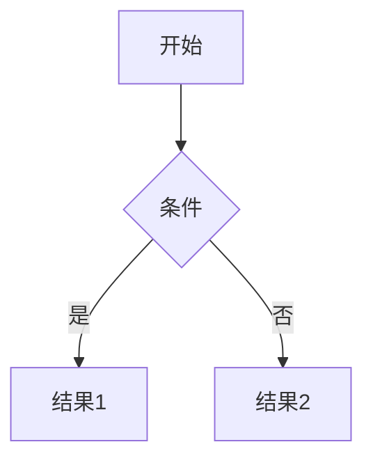
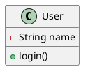

# Markdown Viewer 使用说明

## 🚀 快速开始

1. **启动应用**
   ```bash
   npm start
   ```

2. **访问应用**
   打开浏览器访问: http://localhost:3000

3. **浏览文件**
   - 左侧文件树显示当前目录下的所有Markdown文件
   - 点击文件即可在右侧预览内容
   - 文件夹可以展开/收起

## 🎯 主要功能

### 文件浏览
- **文件树**: 左侧显示目录结构，只显示Markdown文件
- **面包屑导航**: 顶部显示当前文件路径
- **文件刷新**: 点击刷新按钮重新加载文件列表

### 文档导航
- **大纲视图**: 中间显示文档标题结构
- **点击跳转**: 点击大纲项目跳转到对应标题
- **大纲收起**: 可以收起大纲面板节省空间

### 内容渲染
- **Markdown渲染**: 支持标准Markdown语法
- **代码高亮**: 支持多种编程语言的语法高亮
- **表格渲染**: 自动渲染Markdown表格
- **图片显示**: 支持本地和网络图片

### 流程图支持
- **Mermaid**: 支持流程图、时序图、甘特图等
- **PlantUML**: 支持UML图表

### 主题切换
- **多种主题**: 亮色、暗色、蓝色、绿色、紫色
- **一键切换**: 点击主题按钮循环切换
- **自动保存**: 主题偏好自动保存

## ⌨️ 快捷键

| 快捷键 | 功能 |
|--------|------|
| `Ctrl/Cmd + R` | 刷新当前文件 |
| `Ctrl/Cmd + E` | 编辑当前文件 |

## 📊 支持的图表类型

### Mermaid


### PlantUML


## 🔧 高级用法

### 从URL加载文件
可以通过URL参数直接加载指定文件：
```
http://localhost:3000?file=docs/README.md
```

### 文件编辑
点击编辑按钮可以在VSCode中打开当前文件（需要配置VSCode URL协议）

### 实时更新
当Markdown文件被修改时，浏览器会自动刷新显示最新内容

## 🛠️ 故障排除

### 常见问题

1. **文件不显示**
   - 确保文件扩展名是.md, .markdown, .mdown, .mkd, 或 .mkdn
   - 检查文件是否在项目目录下

2. **流程图不渲染**
   - 确保网络连接正常（PlantUML需要网络）
   - 检查语法是否正确

3. **主题切换无效**
   - 清除浏览器缓存
   - 检查浏览器控制台是否有错误

4. **WebSocket连接失败**
   - 检查8080端口是否被占用
   - 确保防火墙没有阻止连接

### 性能优化

- 大型文件可能需要一些时间来渲染
- 建议将大型文档拆分成多个小文件
- 使用大纲导航快速定位内容

## 📱 移动端支持

- 响应式设计，适配各种屏幕尺寸
- 移动端优化的触摸交互
- 可收起侧边栏节省空间

---

如有问题，请查看控制台错误信息或联系开发者。