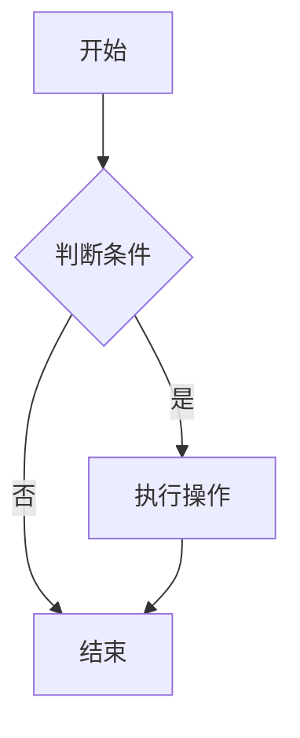
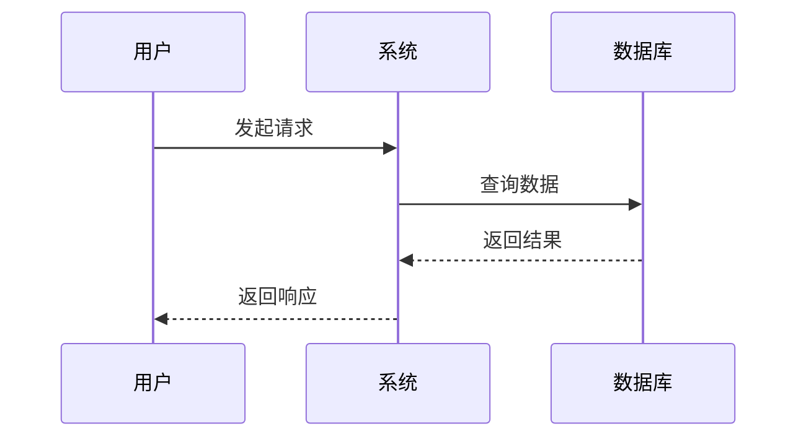
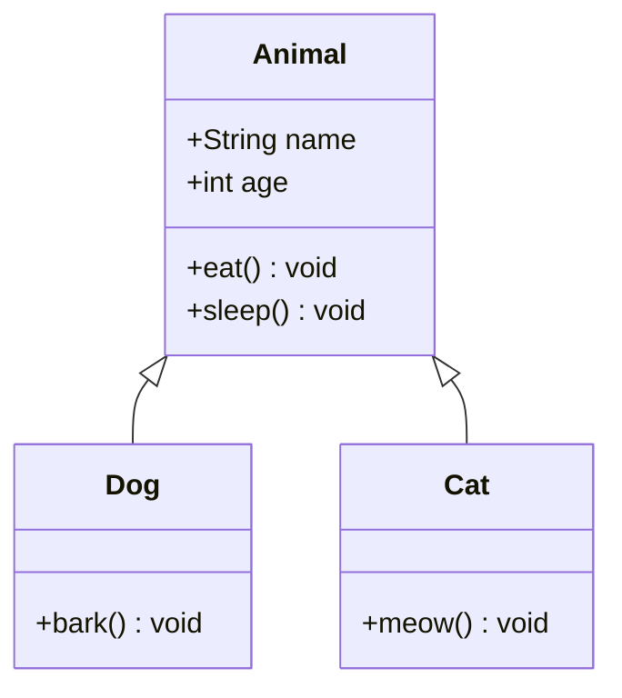
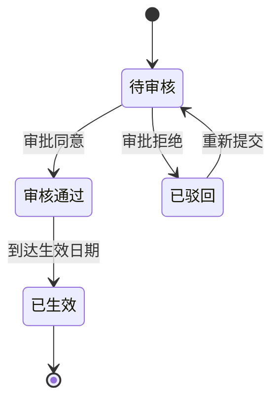
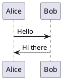

# 流程图测试

## Mermaid 流程图

```mermaid
graph TD
    A[开始] --> B{判断条件}
    B -->|是| C[执行操作]
    B -->|否| D[结束]
    C --> D
```

## Mermaid 时序图

```mermaid
sequenceDiagram
    participant 用户
    participant 系统
    participant 数据库
    用户->>系统: 发起请求
    系统->>数据库: 查询数据
    数据库-->>系统: 返回结果
    系统-->>用户: 返回响应
```

## Mermaid 类图

```mermaid
classDiagram
    class Animal {
        +String name
        +int age
        +eat() void
        +sleep() void
    }
    class Dog {
        +bark() void
    }
    class Cat {
        +meow() void
    }
    Animal <|-- Dog
    Animal <|-- Cat
```

## Mermaid 状态图

```mermaid
stateDiagram-v2
    [*] --> 待审核
    待审核 --> 审核通过: 审批同意
    待审核 --> 已驳回: 审批拒绝
    审核通过 --> 已生效: 到达生效日期
    已驳回 --> 待审核: 重新提交
    已生效 --> [*]
```

## PlantUML 时序图

```plantuml
@startuml
Alice -> Bob: Hello
Bob --> Alice: Hi there
@enduml
```
