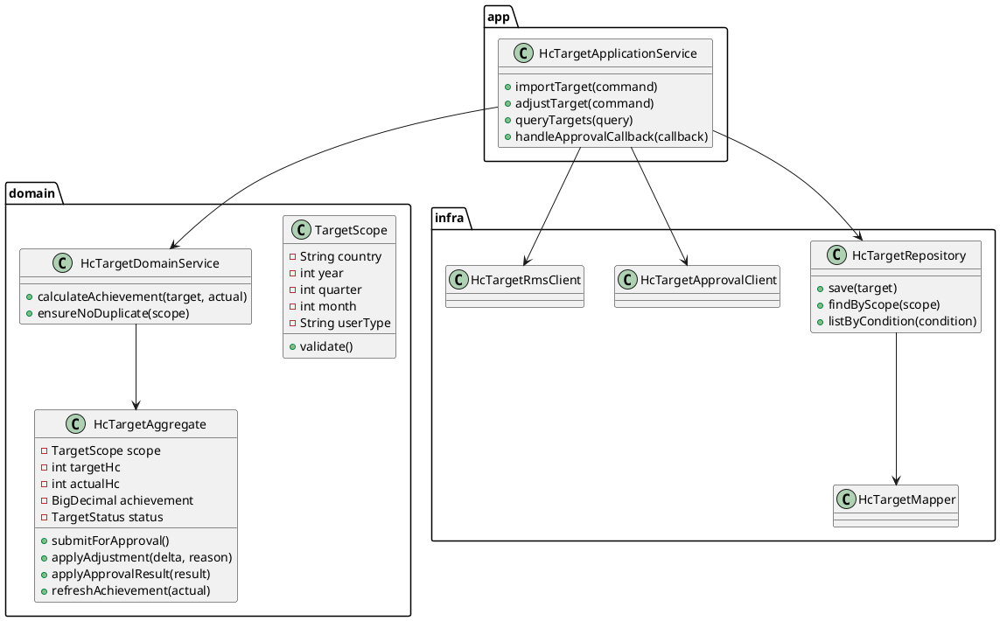

```plantuml
@startuml
package "app" {
  class HcTargetApplicationService {
    +importTarget(command)
    +adjustTarget(command)
    +queryTargets(query)
    +handleApprovalCallback(callback)
  }
}

package "domain" {
  class HcTargetAggregate {
    -TargetScope scope
    -int targetHc
    -int actualHc
    -BigDecimal achievement
    -TargetStatus status
    +submitForApproval()
    +applyAdjustment(delta, reason)
    +applyApprovalResult(result)
    +refreshAchievement(actual)
  }

  class TargetScope {
    -String country
    -int year
    -int quarter
    -int month
    -String userType
    +validate()
  }

  class HcTargetDomainService {
    +calculateAchievement(target, actual)
    +ensureNoDuplicate(scope)
  }
}

package "infra" {
  class HcTargetRepository {
    +save(target)
    +findByScope(scope)
    +listByCondition(condition)
  }
  class HcTargetMapper
  class HcTargetApprovalClient
  class HcTargetRmsClient
}

HcTargetApplicationService --> HcTargetDomainService
HcTargetApplicationService --> HcTargetRepository
HcTargetDomainService --> HcTargetAggregate
HcTargetRepository --> HcTargetMapper
HcTargetApplicationService --> HcTargetApprovalClient
HcTargetApplicationService --> HcTargetRmsClient
@enduml
```